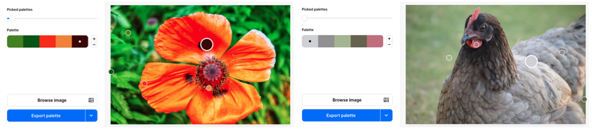

## Upgrade your project

If you have time, you could add more to your mood board or improve the design.

--- task ---

You could:

+ Replace 'lorem ipsum' placeholder text with text that helps to set the mood
+ Add more images or emojis
+ Add more sections of content
+ Add really helpful image `alt` text that would help set the mood for a person using a screen reader
+ Experiment with different border, gradient, or transparency effects
+ Create a different mood board using different techniques and styles 

You could also:
+ Adjust the colour palette

[[[web-colour-palette]]]

Or, you could choose an image and then select a colour palette to match.

[[[rpfeditor-image-library]]]
[[[colours-from-image]]]

**Notice** that `page` is typically kept white `#ffffff`, but you might decide to change it as well. 

+ Check that you colour palette uses contrasting colours

Contrasting colours make the text readable for your user. You can check and adjust your colours using a [contrast checker](https://webaim.org/resources/contrastchecker/){:target="_blank"}.

[[[contrast-checker]]]

**Tip:** If you find it difficult to find contrasting colours, black works well on light backgrounds and white works well on dark backgrounds. 

--- /task ---

**Doodles upgrade**: [See inside](https://editor.raspberrypi.org/en/projects/doodle-upgrade-mood-board){:target="_blank"}

<iframe src="https://editor.raspberrypi.org/en/embed/viewer/doodle-upgrade-mood-board" width="800" height="600" frameborder="0" marginwidth="0" marginheight="0" allowfullscreen> </iframe>

