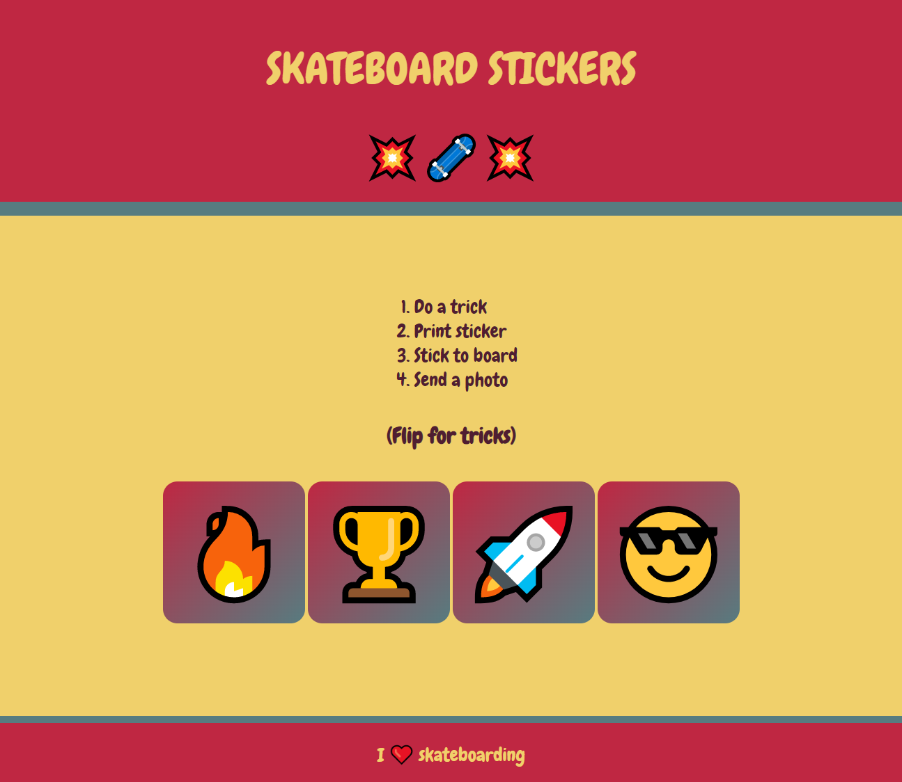

## What next?

If you are following the [Intro to web](https://projects.raspberrypi.org/en/raspberrypi/web-intro) path, you should move on to the [Sell me something](https://projects.raspberrypi.org/en/projects/sell-me-something) project. In this project, you will make a webpage to promote a product or idea.

--- print-only ---

--- /print-only ---

--- no-print ---

**Skateboarding**: [See inside](https://editor.raspberrypi.org/en/projects/skateboarding){:target="_blank"}

<iframe src="https://editor.raspberrypi.org/en/embed/viewer/skateboarding" width="600" height="500" frameborder="0" marginwidth="0" marginheight="0" allowfullscreen> </iframe>

--- /no-print ---

